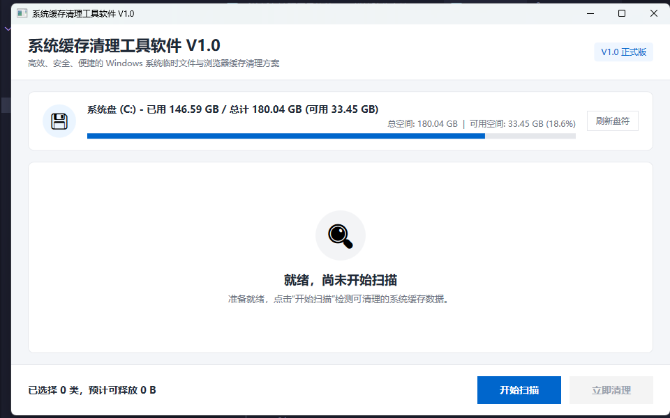

# System Cache Cleaner

一个使用 .NET 8 和 WPF 开发的 Windows 系统缓存清理工具，包含缓存扫描、分类选择、安全清理、取消操作和清理报告。



## 功能

- 扫描用户临时文件、Windows 临时文件和 Microsoft Edge 缓存
- 按类别展示文件数量与预计可释放空间
- 支持扫描取消、重新扫描和清理结果报告
- 清理前二次确认，仅处理当前扫描快照中的选中项目
- 使用白名单、规范化路径和重解析点检查限制清理范围
- 提供 `--demo` 演示模式，避免作品展示时操作真实缓存目录

## 技术栈

- .NET 8
- WPF
- MVVM
- MSTest

## 本地运行

需要 Windows 10/11 和 .NET 8 SDK。

```powershell
dotnet restore SystemCacheCleaner.sln
dotnet build SystemCacheCleaner.sln
dotnet run --project .\src\SystemCacheCleaner\SystemCacheCleaner.csproj
```

演示模式：

```powershell
dotnet run --project .\src\SystemCacheCleaner\SystemCacheCleaner.csproj -- --demo
```

## 测试

```powershell
dotnet test SystemCacheCleaner.sln
```

## 发布 Windows 便携版

```powershell
dotnet publish .\src\SystemCacheCleaner\SystemCacheCleaner.csproj `
  -c Release `
  -r win-x64 `
  --self-contained true `
  -p:PublishSingleFile=true `
  -p:IncludeNativeLibrariesForSelfExtract=true `
  -p:DebugType=None `
  -p:DebugSymbols=false `
  -o .\artifacts\release\SystemCacheCleaner-v1.0.0-win-x64
```

## 项目结构

```text
src/SystemCacheCleaner/          WPF 应用
tests/SystemCacheCleaner.Tests/  自动化测试
docs/                            需求、实现计划和验收文档
artifacts/                       模块验收记录与截图
```

## 安全说明

本项目是个人作品。建议先使用 `--demo` 模式体验，并在重要环境中操作前自行检查代码和备份数据。未签名的发布程序可能触发 Windows SmartScreen 提示。

