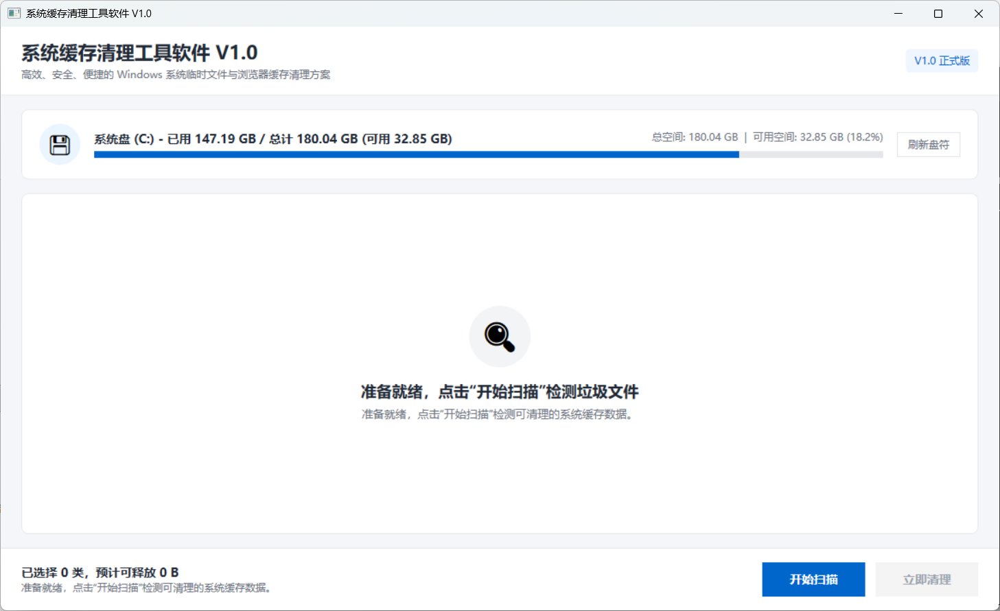
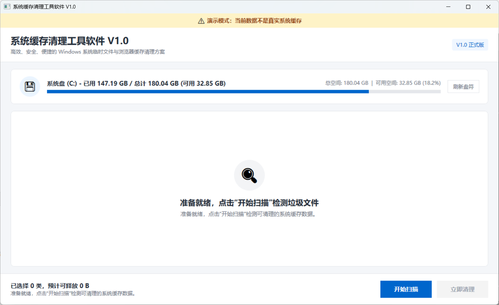
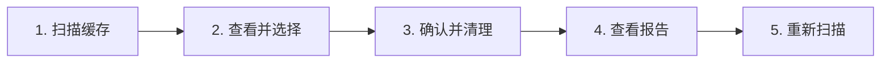
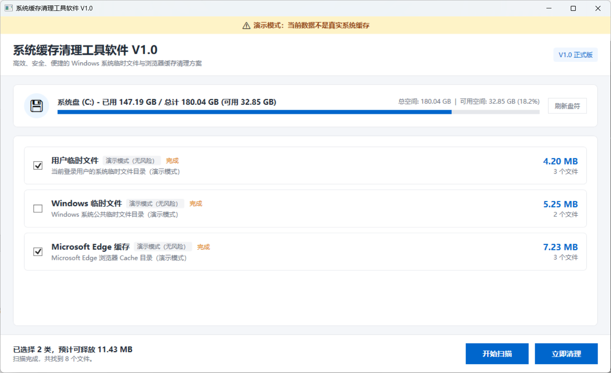
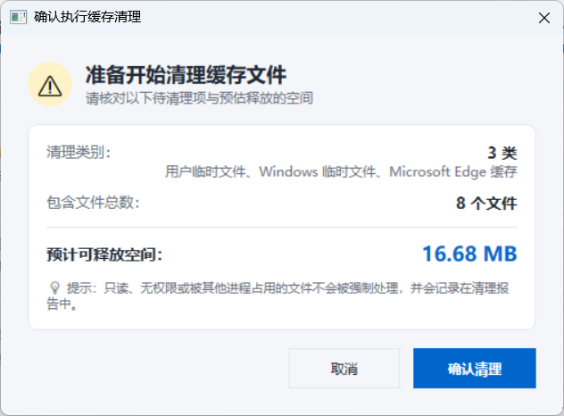
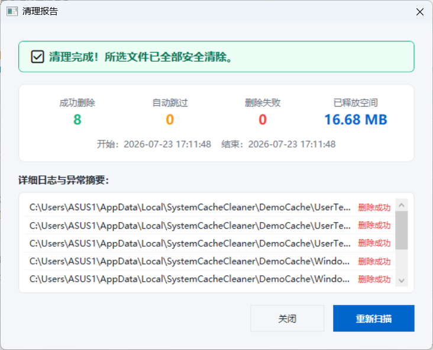
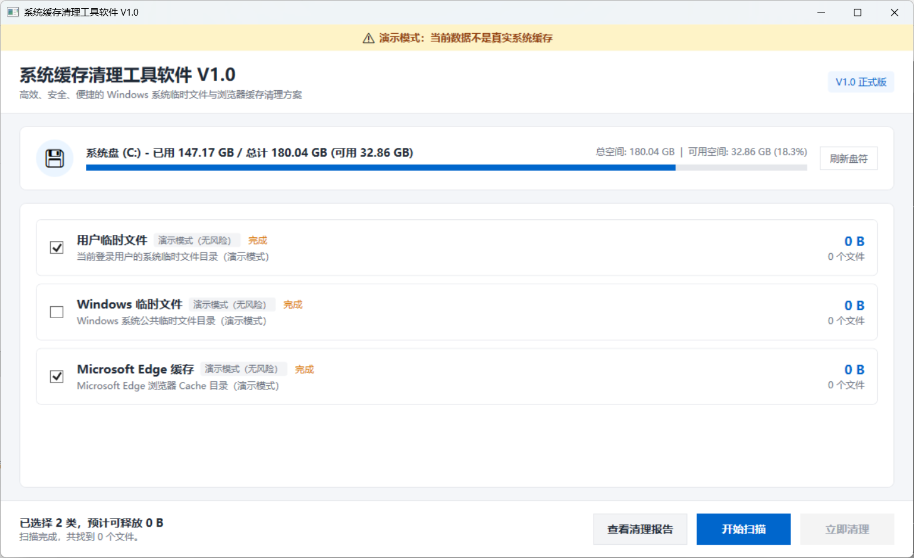

# 系统缓存清理工具软件 V1.0 - 用户操作手册

---

## 1. 软件概述与安全声明

### 1.1 软件简介
《系统缓存清理工具软件 V1.0》是一款专为 Windows 平台打造的专业系统缓存清理工具。软件通过直观的可视化界面，帮助用户快速扫描并安全清理系统中可释放的缓存垃圾文件，从而提升磁盘可用空间与系统运行效率。

### 1.2 安全原则与防护承诺
- **白名单路径防护**：仅在系统预设的通用白名单路径（用户临时文件目录、系统 Temp 目录、浏览器缓存目录等）下工作，绝不擅自越界删除非白名单目录或关键系统文件。
- **重解析点（Junction/符号链接）跨目录防护**：扫描与清理阶段自动识别并跳过带 `ReparsePoint` 属性的目录或文件，不跟随其进入其他位置。
- **只读扫描**：文件扫描过程为完全只读操作，不会修改或删除任何文件。
- **免提权运行**：软件无需系统 Administrator 或 UAC 提权请求，在普通用户权限下安全运行。由于权限不足或被排他性占用的文件将被自动跳过并记录在日志中。

---

## 2. 运行环境与启动方式

- **操作系统**：Windows 10 或 Windows 11，x64。
- **开发运行**：需要安装 .NET 8 SDK。
- **发布版运行**：当前产物为框架依赖发布，目标电脑需要安装 .NET 8 Desktop Runtime。
- **普通模式**：直接双击 `SystemCacheCleaner.exe`，或不带参数启动。
- **演示模式**：在 PowerShell 中执行 `.\SystemCacheCleaner.exe --demo`。

---

## 3. 软件界面与功能区说明

### 3.1 主界面布局

软件主界面包含以下核心功能区域：
1. **标题栏与窗口状态区**：显示软件名称“系统缓存清理工具软件 V1.0”及当前运行模式标志（普通模式或演示模式）。
2. **系统磁盘信息卡片区**：展示当前 Windows 系统所在磁盘的驱动器名称、已用空间、总容量及使用百分比。
3. **主工作与结果展示区**：
   - 扫描前：展示准备就绪引导提示。
   - 扫描后：展示各分类卡片（分类名称、说明、危险等级、勾选复选框、搜索到的文件数量及预估释放大小）。
4. **底部状态与操作区**：展示选中的统计摘要（例如：“已选择 2 类，预计可释放 12.50 MB”）、当前操作状态提示，以及“开始扫描”、“立即清理”、“查看清理报告”等功能按钮。

---

---

## 4. 两种运行模式详解

为了满足正式清理与测试演示的不同需求，软件支持两种运行模式：

| 模式类型 | 启动方式 | 特征与行为描述 |
| --- | --- | --- |
| **普通模式 (正式模式)** | 双击 `SystemCacheCleaner.exe` 直接运行 | 扫描并清理系统真实的本地 Temp 与缓存目录。 |
| **演示模式 (Demo Mode)** | 命令行/ PowerShell 中带参数运行： `SystemCacheCleaner.exe --demo` | 顶部显示黄色提示横幅；仅扫描并清理 `%LOCALAPPDATA%\SystemCacheCleaner\DemoCache\` 隔离目录下的测试数据，绝不破坏真实环境。 |

---

---

## 5. 标准操作流程

标准的缓存清理业务闭环分为以下五个步骤：

### 步骤 1：启动扫描
1. 打开软件，点击右下角的 **“开始扫描”** 按钮。
2. 软件将遍历白名单目录中的缓存文件。扫描期间，右下角显示红色 **“取消扫描”** 按钮，底部状态栏实时显示当前类别和已发现文件统计。

### 步骤 2：查看与勾选结果列表
1. 扫描完成后，主界面展示白名单分类列表。
2. 软件默认自动勾选安全等级为“低风险”的常用缓存项（如“用户临时文件”、“ Edge 浏览器缓存”），而将“Windows 系统 Temp”设为默认取消。
3. 用户可根据需要手动复选或取消勾选特定分类。底部的汇总文本将根据勾选状态实时刷新预估可释放的总空间大小。
4. 本手册采用“全选清理”演示：完成图 3 截图后，再勾选“Windows 临时文件”，使三个类别全部选中。

---

---

### 步骤 3：调起清理与二次确认
1. 勾选完毕后，点击右下角的 **“立即清理”** 按钮。
2. 软件将自动弹出一个模态对话框 **“确认执行缓存清理”**。
3. 对话框中将明确列出即将清理的分类列表、文件总数和预计释放空间，并提示无法安全处理的文件不会被强制删除，而会记录在清理报告中。
4. 若需要继续清理，点击 **“确认清理”**；若希望放弃，点击 **“取消”**。

---

---

### 步骤 4：清理执行与报告呈现
1. 点击确认清理后，软件将进入清理状态，底部状态描述实时更新已处理文件数和已释放空间。
2. 清理结束后，软件会自动弹出 **“清理报告”** 对话框：
   - 若所有被选文件均成功清理，顶部显示绿色 **“清理完成”** 标识。
   - 若存在因独占锁定、只读或权限限制而被跳过/失败的文件，顶部显示橙色 **“部分完成”** 标识，并在下方列表中列出具体文件路径及解释原因（绝不误显“全部成功”）。
3. 主界面底部的系统盘已用空间与可用容量将自动完成刷新。

---

---

### 步骤 5：重新扫描闭环
1. 在清理报告弹窗中，点击 **“重新扫描”** 按钮（或关闭报告后在主界面点击“重新扫描”）。
2. 软件将清空旧的快照，重新检索系统磁盘，已删除的文件将不再出现，业务流程实现完全闭环。
3. 本次演示全选了三个类别，因此重新扫描后三个类别均应显示 0 个文件和 0 B。

---

## 6. 常见问题与排查指南

### Q1: 为什么清理报告中显示“删除失败：文件被独占锁定”？
* **解答**：这属于正常安全机制。部分 Temp 或缓存文件（例如当前正在运行的浏览器或后台系统服务所打开的文件）处于被独占打开状态 (`FileShare.None`)。软件遵循安全原则，不会强行杀死进程或破坏文件句柄，会自动将其安全跳过并记录在报告中。建议关闭对应后台软件后重新扫描清理。

### Q2: 在扫描中或清理中关闭窗口会发生什么？
* **解答**：软件具备完整的生命周期关怀保护。
  - 在扫描中点击关闭窗口：软件将弹出对话框确认，点击确认后会发出取消信号并安全关闭。
  - 在清理中点击关闭窗口：软件将弹出警示框提示“停止后已删除的文件无法恢复”，确认后软件将停止开始新的文件删除，等待当前正在进行的文件处理完毕后优雅退出，绝不产生无响应残留进程。

### Q3: 如何在测试环境初始化模拟演示数据？
* **解答**：请打开 PowerShell，进入项目工具目录并运行：
  `powershell -ExecutionPolicy Bypass -File .\tools\Prepare-DemoData.ps1`
  运行后即可配合 `--demo` 参数进行受控演示。
